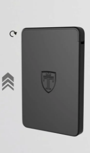
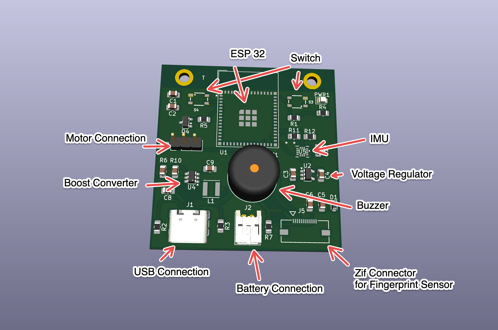

# Smart Wallet — Biometric Anti-Theft Card Holder

**Custom ESP32-S3 PCB · FreeRTOS firmware · on-sensor fingerprint matching · IMU snatch detection · BLE control · WiFi alerts**

A card wallet that stays physically locked until it recognises its owner's
fingerprint, watches its IMU for the motion signature of a snatch, uses the BLE
link to the owner's phone as a proximity sensor, and pushes an alert over WiFi
when the phone is out of range.

Designed from scratch: state machine → schematic → four-layer PCB → soldering →
bring-up → drivers → RTOS firmware.

<p align="center">
  
  
</p>

---

## The problem

RFID-blocking wallets stop card skimming but do nothing when the wallet is
taken. Bluetooth trackers help you find a wallet after it is gone but do not
prevent the theft or stop a thief opening it.

This wallet covers the other half: the cards sit behind a servo latch that only
an enrolled fingerprint retracts, so a stolen wallet is a locked box, and the
alarm fires at the moment of the snatch.

---

## Features

| | |
|---|---|
| **Physical lock** | Micro servo latch, 180° locked / 120° open, 800 ms travel, auto-relock after 5 s. |
| **On-sensor matching** | FPC2534 armed in the background with `requestIdentify(ID_TYPE_ALL)` whenever locked. Templates and the match decision stay on the sensor — no fingerprint image crosses the UART or reaches the phone. |
| **Snatch detection** | 6-DoF IMU at 104 Hz, polled every 10 ms. Theft is declared only when jerk > 0.75 g **and** rotation > 180 °/s in the same sample. Walking gives one, turning gives the other, a grab gives both. |
| **Phone control** | Four BLE opcodes: multi-touch enrolment, wipe all templates, list the database, manual latch override. No on-device enrolment path. |
| **Lockout handling** | Five failed scans put the FPC2534 into a 15 s internal lockout. The firmware mirrors it with a non-blocking deadline, suppresses re-arming, then aborts and resyncs. |
| **Proximity** | A BLE disconnect means the wallet and its owner have separated. |
| **Out-of-band alerts** | TLS webhook POST over WiFi on its own task, so a slow handshake never delays a lock. Fires on disconnect, tamper alarm, manual override and biometric lockout. |

---

## Documentation

| | |
|---|---|
| **[1. Firmware architecture](docs/01-system-architecture.md)** | States, tasks, event bits, BLE protocol, theft rule, known gaps. |
| **[2. Hardware design](docs/02-hardware-design.md)** | Components, bus choices, PCB layout, power tree, pin map as built. |
| **[3. Board bring-up](docs/03-board-bringup-and-debugging.md)** | The bring-up ladder and the three hardware faults this board shipped with. |
| **[4. FPC2534 UART debugging](docs/04-fpc2534-uart-debugging.md)** | Error 33 — the bug that blocked the whole product. |
| **[5. System integration debugging](docs/05-system-integration-debugging.md)** | The seven bugs that only exist between components, worst first. |
| **[Test catalogue](test/README.md)** | The seven flashable test images and what each proves. |

---

## System architecture

```
        core 1 (application)                    core 0 (shared with the radios)
  +------------------------------+        +------------------------------------+
  |  SysManager   prio 2   4 KB  |        |  IMU_Track   prio 2   4 KB         |
  |  the only writer of state    |        |  polls the IMU every 10 ms         |
  |                              |        |                                    |
  |  BioAuth      prio 2   8 KB  |        |  NetAlert    prio 1   6 KB         |
  |  owns Serial1 exclusively    |        |  WiFi + TLS webhook POST           |
  +------------------------------+        +------------------------------------+
                    |                                        |
                    +------------------+---------------------+
                                       v
                    systemEvents       (event group, 4 bits)
                    bleCommandQueue    (BLE opcodes,   depth 5)
                    alertMessageQueue  (alert strings, depth 4)
```

```
  LOCKED --finger--> AUTH_VERIFYING --match--> UNLOCKED --5 s--> LOCKED
     ^  ^                  |                       |
     |  +--- BLE 0x04 -----+                       |
     |                                             |
     +--- TAMPER_ALARM <---- theft signature <-----+
```

Three rules hold it together:

- **One writer.** `currentState` is written by `TaskSystemManager` and nothing
  else. Every other task raises a bit and lets the manager decide. No mutexes.
- **Primitives, not shared memory.** Tasks talk through one event group and two
  queues. No task dereferences another task's data.
- **Latency-sensitive work on core 1.** The state machine and the UART driver
  are pinned away from the radio stacks on core 0.

Details: [docs/01](docs/01-system-architecture.md).

---

## BLE interface

```
service  4FAFC201-1FB5-459E-8FCC-C5C9C331914B   advertised as "SmartWallet"
  |-- STATUS   beb5483e-...-26a8   READ | NOTIFY   one status byte
  +-- COMMAND  beb5483e-...-26a9   WRITE           one opcode byte
```

| Command | | Status | |
|---|---|---|---|
| `0x01` | start multi-touch enrolment | `0x00` | clear |
| `0x02` | delete all templates | `0x01` | wrong finger |
| `0x03` | list the template database | `0x02` | motion / theft detected |
| `0x04` | manual latch override | `0x04` | enrolment in progress |

The write callback queues the opcode and returns; the BLE callback context never
touches the UART. Same UUIDs and encodings as `test/unit/ble_link/`, so the
phone side can be developed against a board with no sensors attached.

---

## Implementation process

```
problem research -> state machine -> schematic -> 4-layer PCB -> fabrication
   -> bring-up ladder (multimeter, then one unit test per peripheral)
   -> integration build under FreeRTOS, no radios
   -> full firmware with BLE + WiFi
```

The state machine came before the schematic, so every component on the board
exists because a transition needed it. Nothing was flashed until the board
passed a fixed sequence of electrical checks — two of the three board faults
were found with a multimeter before a line of firmware ran.

---

## Repository layout

```
├── src/
│   └── main.cpp            the whole firmware: config, BLE, callbacks,
│                           setup(), and the four FreeRTOS tasks
│
├── include/
│   └── secrets.example.h   template for the untracked include/secrets.h
│
├── lib/
│   └── SparkFun_FPC2534/   vendored, not a registry dependency — it is patched
│
├── test/                   seven flashable images; see test/README.md
│   ├── unit/               one peripheral each, no RTOS
│   └── integration/        all drivers together under FreeRTOS, no radios
│
├── docs/                   the reasoning, and the hardware images
└── platformio.ini          one environment per image
```

- `src/main.cpp` is one translation unit on purpose. Every hard bug on this
  project was an *interaction* between subsystems, and keeping the whole of it
  on one screen is what made those visible.
- `lib/SparkFun_FPC2534/` is a fork, not a dependency — the frame synchroniser
  from [docs/04](docs/04-fpc2534-uart-debugging.md) lives inside it.
- `test/integration/full_system_rtos/` is left as written, as-designed pin map
  and all. It proved the concurrency worked before connectivity was added.

---

## Building it

Requires [PlatformIO](https://platformio.org/). The vendored library is already
in `lib/`.

```bash
git clone <this repo>
cd Walet_project

cp include/secrets.example.h include/secrets.h      # untracked; fill in your own

pio run                                             # build the firmware
pio run -e wallet_firmware -t upload -t monitor     # flash it and watch
pio run -e test_imu_i2c -t upload -t monitor        # flash one unit test
```

`main.cpp` includes `secrets.h` unconditionally, so that copy step is required
before the firmware compiles. It needs three defines:

```c
#define WIFI_SSID        "your-network"
#define WIFI_PASS        "your-password"
#define DISCORD_WEBHOOK  "https://discord.com/api/webhooks/..."
```

`platformio.ini` pins `espressif32 @ 7.0.1` — this project uses Arduino-ESP32
core 2.x APIs removed in 3.x. The firmware environment uses the `huge_app`
partition table, because BLE + WiFi + TLS overflows the default 1.4 MB app slot.
Every environment compiles clean with `-Wall`.

---

## Tech

`ESP32-S3-MINI-1` · `FreeRTOS` · `C++` · `PlatformIO` · `Arduino-ESP32` ·
`FPC2534` (UART @ 921600) · `LSM6DS` 6-DoF IMU (I2C) · `BLE GATT` ·
`WiFi` + `mbedTLS` webhook · `KiCad` · 4-layer PCB · logic analyser ·
oscilloscope · hand soldering and rework

---

## My role

Three-person team. My share of the work, end to end:

- **Problem and parts research** — what existing anti-theft wallets do not
  solve, and components that fit an IoT form factor.
- **State machine** — designed before the schematic.
- **Prototyping** — breadboard bring-up of each part before committing copper.
- **Schematic and PCB design** — KiCad, four layers.
- **PCB soldering and debugging** — including the three rework fixes in
  [docs/03](docs/03-board-bringup-and-debugging.md).
- **Firmware testing** — the unit test per driver, the integration build, and
  the bring-up ladder they sit at the top of.
- **Firmware development** — the FreeRTOS architecture, the drivers, the state
  machine, the FPC2534 frame synchroniser, the BLE command protocol, the IMU
  snatch rule, and the alert path.
- **System integration debugging** — the seven cross-component bugs in
  [docs/05](docs/05-system-integration-debugging.md), which is where most of the
  firmware time after "each driver works" went.

The companion phone app and parts of the BLE/IoT integration were built by
teammates; this repo is the wallet side of that link.

**Team:** Alexis Navarrete · Aiden Krueger · Erictuan Nong
**Course:** ECE 196, UC San Diego, Spring 2026

---

## Status

Working prototype, demonstrated end to end: enrolment, matching and template
management from the phone, servo lock and auto-relock, manual BLE override, IMU
snatch detection, BLE status notifications, and the WiFi webhook alert path.

Known gaps: [docs/01 §1.8](docs/01-system-architecture.md#18-known-gaps). The
most serious is that the BLE COMMAND characteristic is plain `PROPERTY_WRITE`
with no bonding, so any device in range can erase every template or open the
latch — closing it needs a coordinated change with the companion app.

Three fixes in [docs/05](docs/05-system-integration-debugging.md) are diagnosed
but not yet in `src/main.cpp`; §5.0 says which. Hardware fixes for a rev B are
in [docs/02 §2.8](docs/02-hardware-design.md#28-what-a-rev-b-would-change).
