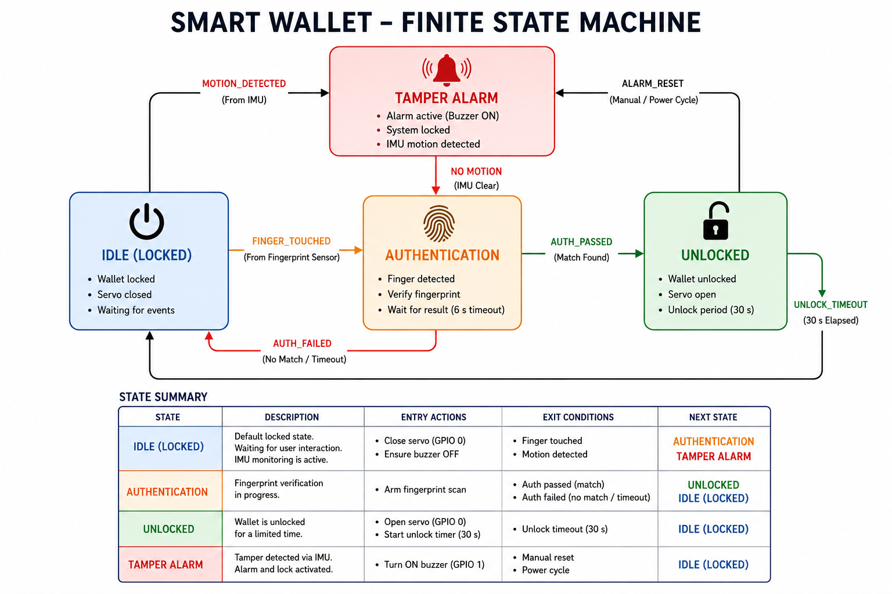

# 1. Firmware Architecture

The shipped image is `src/main.cpp`: one translation unit, four FreeRTOS tasks,
one event group, two queues.

---

## 1.1 The state machine



Four states, one `switch` in `TaskSystemManager`.

| State | Meaning | Leaves on |
|---|---|---|
| `ST_LOCKED` | Latch at 180°. Scanner armed, theft detection armed. Blocks on the event group at `portMAX_DELAY`. | `FLAG_FINGER_TOUCHED` → `AUTH_VERIFYING`; `FLAG_THEFT_DETECTED` → `TAMPER_ALARM`; `FLAG_AUTH_PASSED` → `UNLOCKED` |
| `ST_AUTH_VERIFYING` | The sensor is matching on-chip. | `FLAG_AUTH_PASSED` → `UNLOCKED`; `FLAG_AUTH_FAILED` or 6 s timeout → `LOCKED` |
| `ST_UNLOCKED` | Latch at 120°, 5 s relock timer. | Timer expiry → `LOCKED`; `FLAG_THEFT_DETECTED` → `TAMPER_ALARM` |
| `ST_TAMPER_ALARM` | Queues a webhook alert, then a bounded 2.5 s window (10 × 250 ms) in which a valid finger silences it. | Always → `LOCKED` |

Three differences from the drawn machine:

- **The alarm is bounded, not latched.** The drawing leaves `TAMPER ALARM` only
  on a power cycle. On a wallet-sized cell, one false positive in a backpack
  would flatten the battery by lunchtime.
- **The buzzer is gone.** Its GPIO drives the servo after the rework, so the
  alarm's outputs are the BLE notification and the webhook. See
  [docs/03](03-board-bringup-and-debugging.md).
- **`ST_LOCKED` accepts an unlock that never touched the sensor** — BLE opcode
  `0x04` sets `FLAG_AUTH_PASSED` directly.

---

## 1.2 Tasks and the concurrency contract

| Task | Core | Prio | Stack | Owns |
|---|---|---|---|---|
| `SysManager` | 1 | 2 | 4 KB | `currentState`, the servo, every sensor re-arm |
| `BioAuth` | 1 | 2 | 8 KB | `Serial1` / the FPC2534, the BLE command queue |
| `IMU_Track` | 0 | 2 | 4 KB | `Wire` / the IMU |
| `NetAlert` | 0 | 1 | 6 KB | WiFi + the TLS webhook POST |

- **One writer.** `currentState` is written by `TaskSystemManager` and nothing
  else. Every other task raises a bit and lets the manager decide. That is why
  the firmware contains no mutexes. The only other shared state is
  `failedAttemptCounter` and `lockoutUntilMs` — single-word `volatile` scalars
  with one producer each.
- **Primitives, not shared memory.** One event group, two queues. No task
  dereferences another task's data. `alertMessageQueue` carries `const char*`
  pointers to string literals, so there is no allocation on the alert path.
- **Nothing blocks that does not have to.** `ST_LOCKED` and `NetAlert` both sit
  on `portMAX_DELAY`, so an idle wallet costs zero CPU.
- **Core placement.** WiFi and BLE live on core 0. The state machine and the
  UART driver are pinned to core 1 so a radio event can never sit in front of a
  finger press. `loop()` is parked on `vTaskDelay(portMAX_DELAY)`.

---

## 1.3 Event bits

| Bit | Set by | Meaning |
|---|---|---|
| `FLAG_THEFT_DETECTED` | `TaskIMUTelemetry` | Jerk **and** rotation over threshold in one sample |
| `FLAG_FINGER_TOUCHED` | FPC2534 `on_status` | Finger on the array while locked |
| `FLAG_AUTH_PASSED` | FPC2534 `on_identify`, **or** BLE `0x04` | Open the latch |
| `FLAG_AUTH_FAILED` | FPC2534 `on_identify` | No template matched |

`FLAG_AUTH_PASSED` has two producers on purpose: to the state machine, "the
sensor matched" and "the paired phone asked" are the same authorisation, so
there is one unlock path rather than two.

---

## 1.4 BLE interface

```
service  4FAFC201-1FB5-459E-8FCC-C5C9C331914B   advertised as "SmartWallet"
  |-- STATUS   beb5483e-36e1-4688-b7f5-ea07361b26a8   READ | NOTIFY  (+ CCCD)
  +-- COMMAND  beb5483e-36e1-4688-b7f5-ea07361b26a9   WRITE
```

**STATUS**, one byte, notified on change:

| Value | Name | Raised when |
|---|---|---|
| `0x00` | `BLE_FLAG_CLEAR` | Match accepted, latch opening, or enrolment finished |
| `0x01` | `BLE_FLAG_WRONG_FINGER` | Identify found no match |
| `0x02` | `BLE_FLAG_IMU_MOVING` | Theft signature detected |
| `0x04` | `BLE_FLAG_ENROLLING` | Enrolment session open; prompt for taps |

**COMMAND**, one opcode byte. The write callback pushes it onto
`bleCommandQueue` and returns — the BLE callback context never touches the UART.

| Opcode | Name | What `BioAuth` does |
|---|---|---|
| `0x01` | `BLE_CMD_ENROLL_START` | Notify `ENROLLING`, reset to cancel the standing identify, `requestEnroll(ID_TYPE_GENERATE_NEW)`. The app tracks progress from `on_enroll`'s samples-remaining count |
| `0x02` | `BLE_CMD_DELETE_ALL` | Reset, `requestDeleteTemplate(ID_TYPE_ALL)`, re-arm |
| `0x03` | `BLE_CMD_LIST_TEMPLATES` | Reset, `requestListTemplates()`, print the slot/ID table, re-arm |
| `0x04` | `BLE_CMD_SERVO_OPENING` | Set `FLAG_AUTH_PASSED` — the manual override |

A disconnect is the proximity signal: `onDisconnect` restarts advertising and
queues an out-of-band alert.

---

## 1.5 Biometric session management

The FPC2534 is a *matching* sensor, not an imager. Templates and the match
decision live on the part; what crosses the UART is a verdict and an ID.

- **Armed in the background, not polled.** While locked, `BioAuth` keeps an
  identify request outstanding against the whole database
  (`requestIdentify(ID_TYPE_ALL)`). `arm_identify_mode()` drains the RX ring
  first, so a stale frame is never read as the answer to a command not yet sent.
- **Exactly one component arms it.** `on_identify` only sets an event bit;
  `TaskSystemManager` owns every re-arm. Two arming callers is what caused
  [§5.1](05-system-integration-debugging.md#51-consecutive-failed-scans-locked-the-sensor-up).
  The one surviving callback-side arm is at the end of enrolment, where no scan
  can be outstanding.
- **Management commands cancel the standing scan first.** Opcodes `0x01`–`0x03`
  each begin with `sendReset()` and a bounded 600 ms drain before the real
  request, and re-arm when done.
- **Failed attempts are counted, because the sensor counts them too.** Five
  consecutive non-matches trigger a 15 s internal lockout during which the part
  refuses commands. The firmware mirrors it: `lockoutUntilMs = millis() + 15500`,
  a webhook alert, and no re-arm until the deadline passes — then
  `requestAbort()`, drain, re-arm. A successful match resets both counters.
  See [§5.2](05-system-integration-debugging.md#52-the-hardware-lockout-stall).

The lockout is a deadline compared against `millis()`, not a `vTaskDelay`.
`BioAuth` keeps servicing the UART and the BLE queue throughout, so enrolment
and template management still work during a lockout.

---

## 1.6 Theft detection

`TaskIMUTelemetry` configures 104 Hz on both sensors and reads gyro and
accelerometer in one 12-byte block from `OUTX_L_G` (0x22) every 10 ms.

```c
currentLinearMag      = sqrt(ax*ax + ay*ay + az*az)
deltaJerk             = |currentLinearMag - lastLinearMag|
totalRotationVelocity = sqrt(gx*gx + gy*gy + gz*gz)

if (deltaJerk > 0.75 && totalRotationVelocity > 180.0)   ->  FLAG_THEFT_DETECTED
```

Requiring **both** in the **same sample** is what makes it usable: walking gives
jerk, turning gives rotation, a snatch gives both. Using the magnitude of `a`
rather than per-axis deltas keeps the rule orientation-independent, which matters
because a wallet has no fixed orientation in a pocket.

Only evaluated while `ST_LOCKED` — an unlocked wallet is in its owner's hands.
Thresholds were tuned against the `PEAK` line in `test/unit/imu_i2c/`.

---

## 1.7 The alert path

When the phone is out of range, BLE cannot deliver anything. `NetAlert` blocks
on `alertMessageQueue`, brings up WiFi on demand, and POSTs a webhook embed.

| Source | Message |
|---|---|
| `onDisconnect` | wallet may be out of range — phone disconnected |
| `ST_TAMPER_ALARM` entry | high-g snatch motion signature detected |
| 5th consecutive failed scan | 5 failed biometric attempts, hardware locked out |

- **WiFi connects lazily**, on the first alert, with a 10 s retry budget
  (20 × 500 ms). A wallet that joins an AP it will not use for hours spends
  current for nothing.
- **The handshake runs on core 0 at priority 1** — below the IMU, on the other
  core from the state machine, so a lock never waits on a certificate.
- **`client.setInsecure()`** — encrypted, but the endpoint is not authenticated.

---

## 1.8 Known gaps

- **The BLE command channel is unauthenticated.** COMMAND is plain
  `PROPERTY_WRITE` with no bonding or encryption, so any device in range can
  write `0x02` and erase every template, `0x01` and enrol its own finger, or
  `0x04` and open the latch. Enrolment and override are reachable only over BLE,
  so there is no second factor behind them. This is the most serious outstanding
  issue: it undoes the threat model the product exists for. Fixing it requires
  bonding on that characteristic, which the companion app has to pair for — a
  coordinated change across two codebases.
- **The webhook endpoint is not authenticated** — `setInsecure()` skips
  certificate validation. Fixing it means carrying the root CA in flash.
- **The IMU scale factors do not match the configured ranges.** `CTRL1_XL` and
  `CTRL2_G` are both `0x40` (104 Hz, ±2 g, ±245 dps), but the conversions use
  0.122 mg/LSB and 17.50 mdps/LSB — the ±4 g and ±500 dps constants. Every
  reported figure is 2× physical. Behaviour is unaffected, because the
  thresholds were tuned empirically in these units, but a retune has to know.
- **`secrets.h` is required to build.** `main.cpp` includes it unconditionally.
  The example file also names the webhook `WEBHOOK_URL`; the firmware expects
  `DISCORD_WEBHOOK`.
- **No buzzer** — its GPIO drives the servo. Board fix, not a firmware one.
- **No battery management** — the board carries the charger and boost converter;
  the firmware reads no cell voltage and implements no sleep policy.
- **The phone app is not in this repo.** Built by a teammate; this is the wallet
  side of the link.
- **The vendor library is patched in place** — a fork, not a clean upstream
  contribution. See [docs/04](04-fpc2534-uart-debugging.md).
