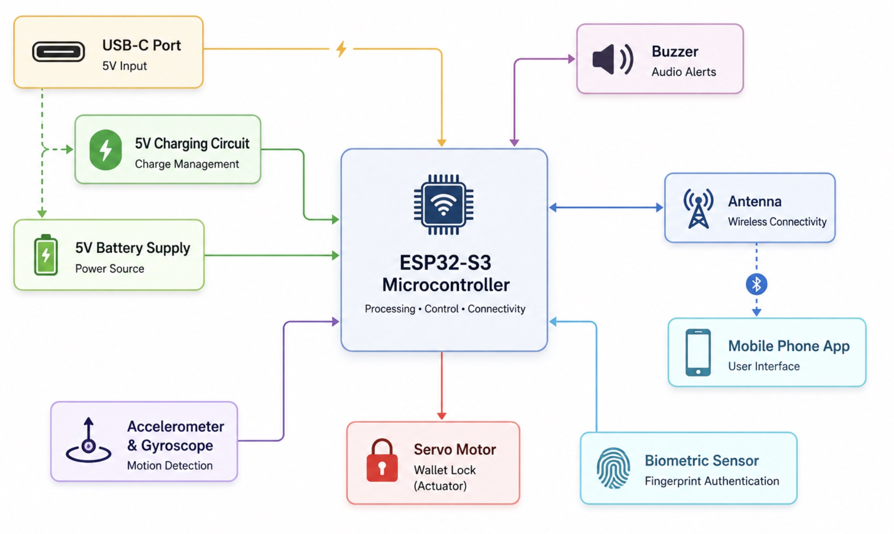
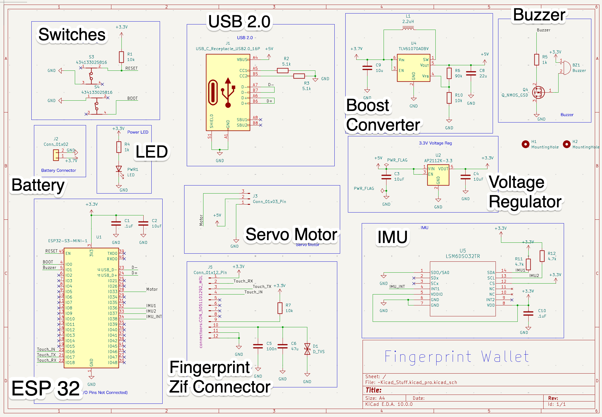
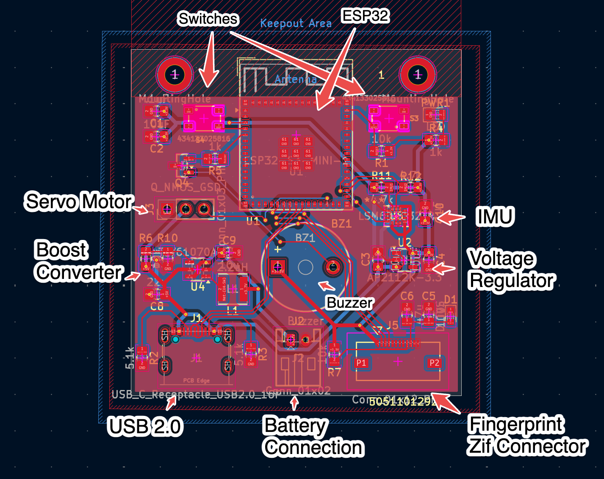
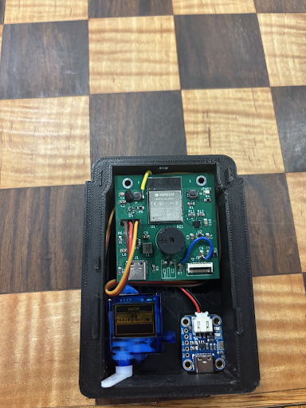

# 2. Hardware Design

Custom four-layer PCB around an ESP32-S3-MINI-1. The faults it shipped with are
in [3. Board bring-up](03-board-bringup-and-debugging.md).

---

## 2.1 The order the design was done in

```
problem research -> state machine -> feature requirements -> parts research
   -> breadboard prototype -> schematic -> PCB layout -> fab, soldering, bring-up
```

The state machine came before the schematic, not after. Every component on this
board exists because a transition in the machine needed it: a servo because
`UNLOCKED` has to physically do something, an IMU because `TAMPER_ALARM` needs a
trigger that is not a button. Drawing the behaviour first kept the bill of
materials from growing features nobody asked for.

---

## 2.2 Block diagram



Everything hangs off one MCU. No second processor, no external secure element:
the ESP32-S3 does the matching request, the motion maths, the actuation and both
radios.

---

## 2.3 Component selection

The constraint behind every choice: this has to fit inside a card wallet and run
off a small cell. Small, low power and integrated beats fast and flexible.

| Function | Part | Why this one |
|---|---|---|
| MCU + radios | **ESP32-S3-MINI-1** | BLE and WiFi in one certified-antenna module; dual core, so the radio stack and the application can be pinned apart; native USB for a console with no USB-serial bridge; no RF matching network to design |
| Fingerprint | **FPC2534** | A matching sensor, not a raw imager — templates and the match decision stay on the sensor, so no biometric image crosses the UART or reaches the phone. ZIF ribbon suits a thin enclosure |
| Motion | **LSM6DSO** (6-DoF) | Accelerometer and gyroscope in one 2.5 mm package; a snatch needs both. Driven by raw register writes, so it is register-compatible across the LSM6DS3/LSM6DSO family |
| Lock | micro servo | The card-ejection mechanism needs travel, not a solenoid pulse. One PWM pin, holds position without holding current |
| Alert | piezo buzzer + N-MOS | Loud for its size. Switched through a transistor because the element's current is beyond what a GPIO should source |
| Power | USB-C in, Li-cell, charger, boost converter, 3V3 LDO | USB-C for charging and console; boost keeps the servo rail up as the cell sags; LDO gives the digital section a quiet 3V3 |

**Why UART for the fingerprint sensor and I2C for the IMU** — the hardware
decision that shaped the firmware most:

- **FPC2534 → UART.** SPI is faster, but the FPC2534 supports host-driven deep
  sleep over UART, and for a device idle 99.9 % of its life, standby current is
  the whole energy budget. SPI buys a faster scan no user can perceive and loses
  the sleep mode. Two traces instead of four.
- **LSM6DSO → I2C.** Two traces on a dense stack-up, a shared bus another
  sensor could join later, and far cheaper debugging — a logic-analyser capture
  of an I2C transaction reads by eye. At 104 Hz, bandwidth was never a concern.

---

## 2.4 Schematic and layout





Schematic rules:

1. **Follow the manufacturer's reference circuit** — decoupling, feedback
   dividers, the boost converter's inductor and compensation all come from the
   datasheet's recommended application, not from invention.
2. **Every net that might need probing gets a place to probe it.** Rails, sensor
   lines and strapping pins are all reachable, which is the only reason the
   bring-up in [docs/03](03-board-bringup-and-debugging.md) was possible.

Placement was decided before a single trace was routed:

- **Shortest path between the MCU and every IC.** ESP32-S3 centre-top, the IMU
  (U5) immediately right, the ZIF (J5) directly below. At 921600 baud trace
  length starts to matter.
- **Support components hug their IC.** Decoupling against the pin it decouples,
  L1 against U4, C3/C4 flanking U2 — a decoupling cap 20 mm from its pin is a
  decoration.
- **Power and connectors on the edges, logic in the middle**, so the enclosure
  can route cables without crossing the logic section.

---

## 2.5 Power tree

```
   USB-C 5 V ──┬──> charge management ──> Li-cell ──┬──> boost converter ──> 5 V servo rail
               │                                     │
               └─────────────────────────────────────┴──> 3V3 LDO ──> ESP32-S3, IMU, FPC2534
```

The servo is the only load that wants more than 3.3 V and the only one that
draws a burst of current, so it gets its own boosted rail. The digital section
sits behind the LDO where the servo's inrush cannot pull the MCU's supply down
mid-transaction.

---

## 2.6 Pin map (as built)

Declared at the top of `src/main.cpp`, which is the single source of truth the
firmware compiles against.

| Signal | GPIO | Bus | Note |
|---|---|---|---|
| FPC2534 TX | 17 | UART1 @ 921600 8N1 | |
| FPC2534 RX | 18 | UART1 | 2 KB RX ring, not the Arduino default 512 B |
| FPC2534 IRQ | 16 | input | configured, but not trusted as finger-present |
| FPC2534 `CS_N` / `SYS_WU` | — | strapped 3V3 | latches UART mode; the part never sleeps |
| FPC2534 `RST_N` | — | strapped 3V3 | no hardware reset line; resets are protocol-level only |
| FPC2534 `VCC` | — | **bodge wire to 3V3** | the ZIF's supply pin was not routed on rev A |
| IMU SDA | 36 | I2C @ 400 kHz | address 0x6A |
| IMU SCL | 37 | I2C | |
| Servo PWM | 1 | LEDC 50 Hz, 500–2400 µs | **the buzzer's original gate net**, taken over during rework |
| Buzzer | 1 | — | not populated |
| Servo (as designed) | 0 | — | never routed to the motor connector on rev A |

Servo constants from the same block, all found with `test/unit/servo_lock/`:

| Constant | Value |
|---|---|
| `LOCKED_ANGLE` | 180° |
| `UNLOCKED_ANGLE` | 120° |
| `SERVO_TRAVEL_MS` | 800 ms |
| `UNLOCK_TIMEOUT_MS` | 5000 ms |

Three pin-map entries are scars, not decisions: the two strapped pins and the
servo sharing the buzzer's net. **The servo's PWM timer is also a shared
resource** — GPIO 1 runs through the LEDC block, which the WiFi and BLE stacks
allocate from too. That is a firmware constraint no schematic can show; see
[§5.3](05-system-integration-debugging.md#53-ledc-timer-clash-detached-the-servo).

---

## 2.7 Enclosure




The board is one layer in a stack: top shell with the sensor cutout, the PCB,
the cell, an RFID-blocking mesh, the card stack, the chassis. That stack-up
fixed the board outline and forced connectors to the edges — the PCB could not
grow to make routing easier, so placement had to absorb the constraint.

---

## 2.8 What a rev B would change

1. **Route the motor net to a real GPIO.** The most expensive mistake on this
   board, and the reason there is no buzzer.
2. **Bring `SYS_WU` and `RST_N` to GPIOs instead of strapping them to 3V3.**
   Unlocks the FPC2534 deep-sleep mode UART was chosen for, and gives the
   firmware a hardware reset when the link desynchronises.
3. **Connect the ZIF's supply pin to 3V3 in copper**, not with a wire.
4. **Fix the N-MOS footprint's gate/source assignment** so the buzzer can return.
5. **Bring the cell voltage to an ADC pin** so a battery policy is possible at
   all.
