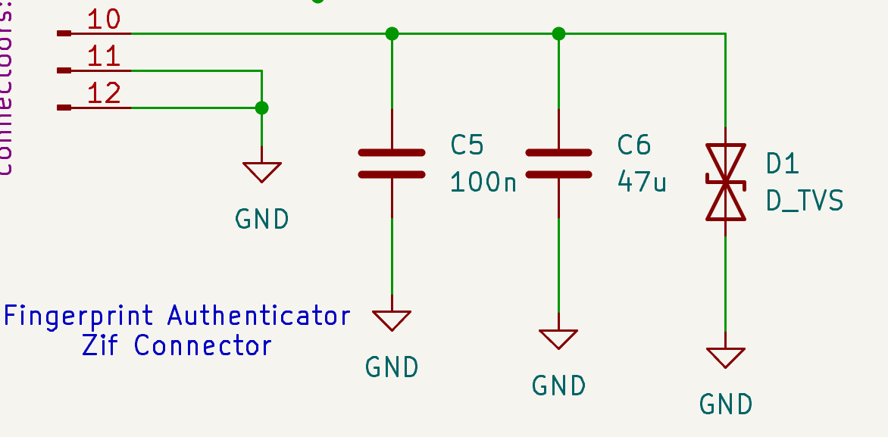
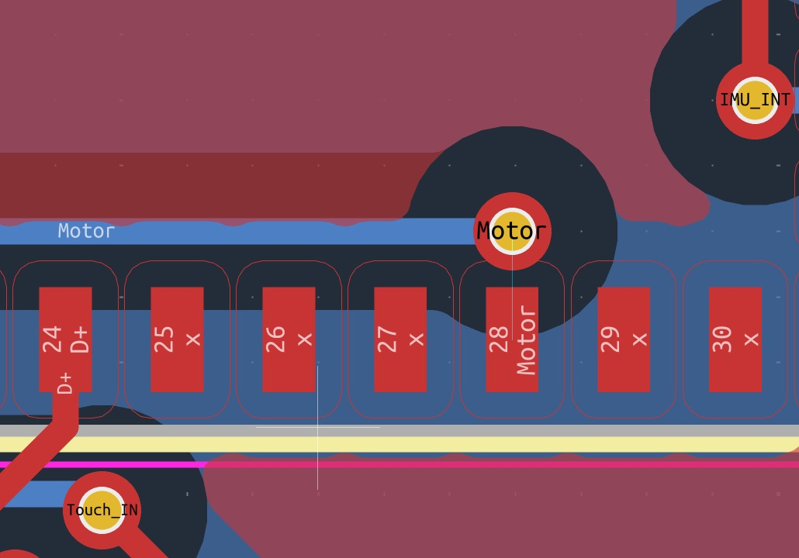
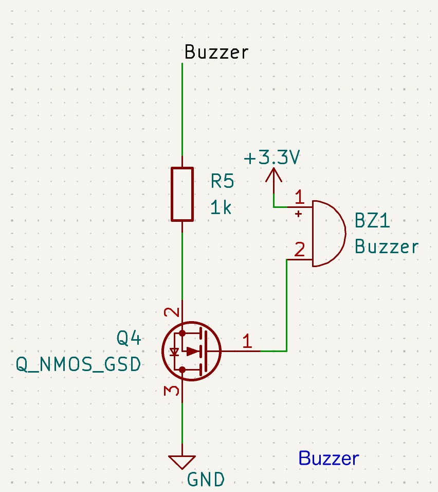

# 3. Board Bring-Up and Debugging

The boards came back from fab with three hardware faults. All three were found
before, or immediately after, the first line of firmware ran.

---

## 3.1 The bring-up ladder

Nothing was flashed until the board passed a fixed sequence of checks. The
principle: never debug two unknowns at once. Each rung assumes the one below it
passed, so a failure always has a small suspect list.

| # | Check | Instrument | What a pass proves |
|---|---|---|---|
| 1 | 3V3 power LED lights on USB | eye | The regulator is alive and not shorted |
| 2 | 3.3 V and 5.0 V rails measured at the load, not the regulator | multimeter | The rails reach the parts that need them |
| 3 | Continuity from each sensor pad to its MCU pin | multimeter | The nets in the layout exist in copper |
| 4 | `BOOT` and `RTS` switches pull their pins | multimeter | The MCU can be put in download mode by hand |
| 5 | Board enumerates over USB | host PC | The MCU runs and its USB peripheral is up |
| 6 | One unit test per peripheral | `pio run -e test_*` | Each driver works with nothing else in the way |
| 7 | All drivers together under FreeRTOS | `pio run -e test_full_system` | The drivers do not interfere once they share a scheduler |

Rungs 1–5 take ten minutes and are the cheapest debugging in the project. Two of
the three board faults were continuity failures found on rung 3.

---

## 3.2 Fault 1 — ZIF connector not connected to 3V3



**Found by:** rung 3. The fingerprint sensor's supply pin had no path to 3V3.
**Cause:** the ZIF connector's `VCC` pin was left unrouted in the layout.
**Fix:** a bodge wire from the 3V3 rail to the connector.

**Cost if missed:** the sensor would have been silent, and the next suspects
would have been the UART, the baud rate or the driver — days of firmware
debugging chasing a hardware fault. Ten minutes with a multimeter instead.

---

## 3.3 Fault 2 — the sensor had no way to be woken

**Found by:** reading the datasheet against the schematic.
**Cause:** in UART mode the FPC2534 needs `CS_N` / `SYS_WU` driven to select
UART and wake the part. Neither that pin nor `RST_N` was wired to a GPIO.
**Fix:** both soldered to 3V3 — UART mode latched, part always awake, never in
reset.

**What that costs:** it throws away the reason UART was chosen. The part can no
longer deep-sleep, so the standby-current argument in
[docs/02](02-hardware-design.md#23-component-selection) is unrealised on rev A.
Two firmware consequences follow:

- the IRQ line is not a trustworthy finger-present signal, because the part
  never sleeps — the firmware arms scans with an explicit `requestIdentify()`;
- recovery from a desynchronised link is `sendReset()` and a wait, not a pin
  toggle. That limitation matters a great deal in
  [docs/04](04-fpc2534-uart-debugging.md).

---

## 3.4 Fault 3 — the motor control net went nowhere



**Found by:** rung 3 again — no continuity between the motor connector's control
pin and any MCU pin.
**Cause:** the servo's control net was never connected to a GPIO. The connector
was there; the signal behind it was not.
**Fix:** the buzzer's N-MOS was desoldered and the servo wired to its gate net,
GPIO 1.

**Cost:** the audible alarm. `TAMPER_ALARM` still fires, but its outputs are the
BLE notification and the webhook.

The trade is visible in the repo. The prototype firmware kept as
`test/integration/full_system_rtos/main.cpp` has the as-designed map:

```c
#define SERVO_PIN       0
#define BUZZER_PIN      1
```

The shipped firmware has the as-built map:

```c
#define SERVO_PIN       1     // Routed to buzzer pad rework
```

One changed number and one deleted define are the entire visible footprint of a
hardware fault that cost the product a feature. There is a second, invisible
cost: GPIO 1 runs through the LEDC block that the radios also allocate from —
see [§5.3](05-system-integration-debugging.md#53-ledc-timer-clash-detached-the-servo).

---

## 3.5 Fault 4 — the N-MOS gate and source were transposed



**Found by:** the buzzer unit test (`test/unit/buzzer/`) — the element stayed
silent or hummed weakly regardless of GPIO state.
**Cause:** gate and source pads swapped in the footprint's net assignment, so
the transistor never switched cleanly.
**Fix:** a replacement part with its legs bent to reach the correct pads.

The test is kept even though it can no longer pass on the reworked hardware,
because a test that caught a real fault is evidence.

---

## 3.6 Not a hardware fault — error 33

With rails good and continuity proven, the fingerprint sensor still returned
`FPC_RESULT_IO_BAD_DATA` continuously. Every instinct said "another board
fault". The hardware was fine; the bug was in how the driver framed a
921600-baud stream. Full account: [docs/04](04-fpc2534-uart-debugging.md).

The lesson is about instruments. A multimeter answers "does this net exist"; a
logic analyser answers "what is actually on the wire"; printf answers "what does
my code think happened". Error 33 needed the last two together, because the
code's belief and the wire's contents had diverged and neither alone showed it.

---

## 3.7 After the reworks, and the ladder's ceiling

Every unit test was re-run on the reworked board and passed. Only then was the
integration build brought up, which runs all the drivers together under FreeRTOS
with the radios left out. That step was almost uneventful — because each driver
had been proven alone, the only new failure mode was interaction, and the few
problems that appeared were unambiguously scheduling problems.

**The ladder stops there, and that is its ceiling.** Everything above
`test_full_system` runs without the radios, because that is what makes it a
clean instrument. Every bug left after this point was therefore radio-adjacent —
the BLE stack taking the servo's PWM timer, mbedTLS overflowing a task stack, a
BLE write landing in a state that was not listening for it. Those are in
[5. System integration debugging](05-system-integration-debugging.md), and none
of them was findable on this ladder.

| Instrument | What it was for |
|---|---|
| Multimeter | Continuity and rails. Found two of the three board faults. |
| Logic analyser | Reading the FPC2534 link when the driver's view and the wire disagreed. |
| Oscilloscope | Seeing that a PWM carrier was absent rather than wrong — [§5.3](05-system-integration-debugging.md#53-ledc-timer-clash-detached-the-servo). |
| Serial console + hex dumps | What the parser actually consumed, byte for byte. |
| `esp32_exception_decoder` | Turning a backtrace into a library name — [§5.4](05-system-integration-debugging.md#54-tls-stack-overflow-on-the-first-webhook-push). |
| One PlatformIO env per test | Flashing exactly one driver, with nothing else in the image. |
